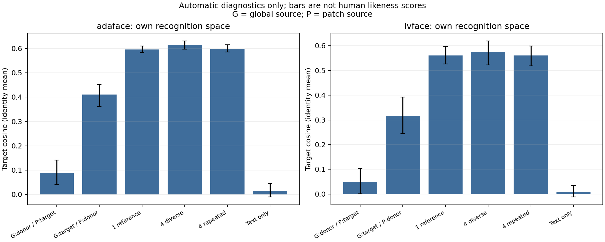
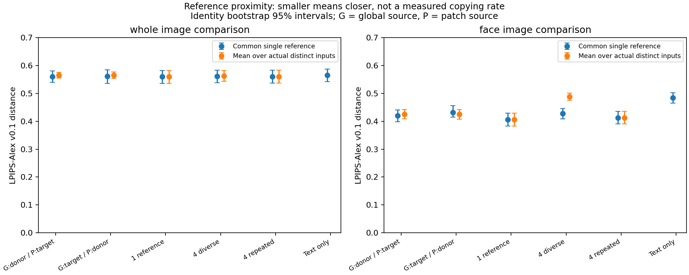
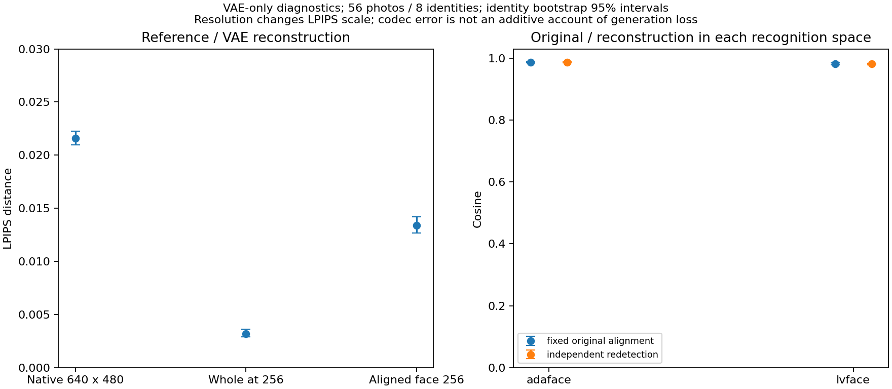
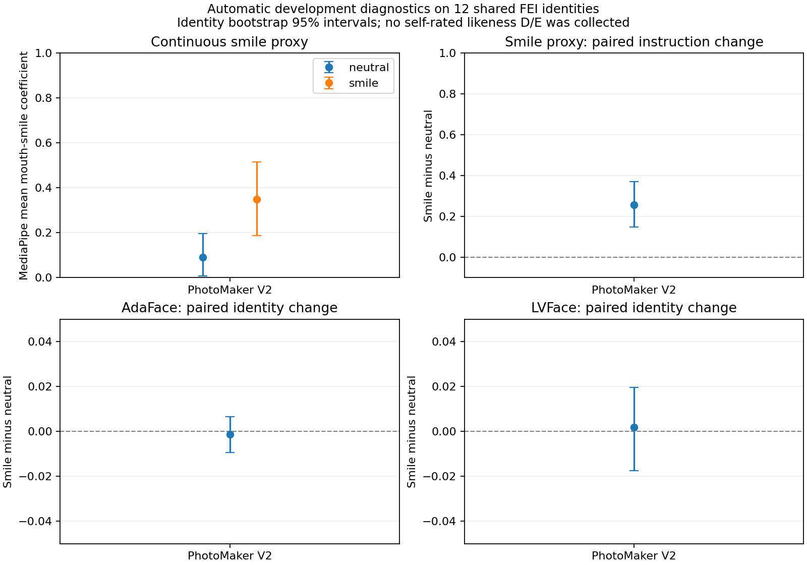
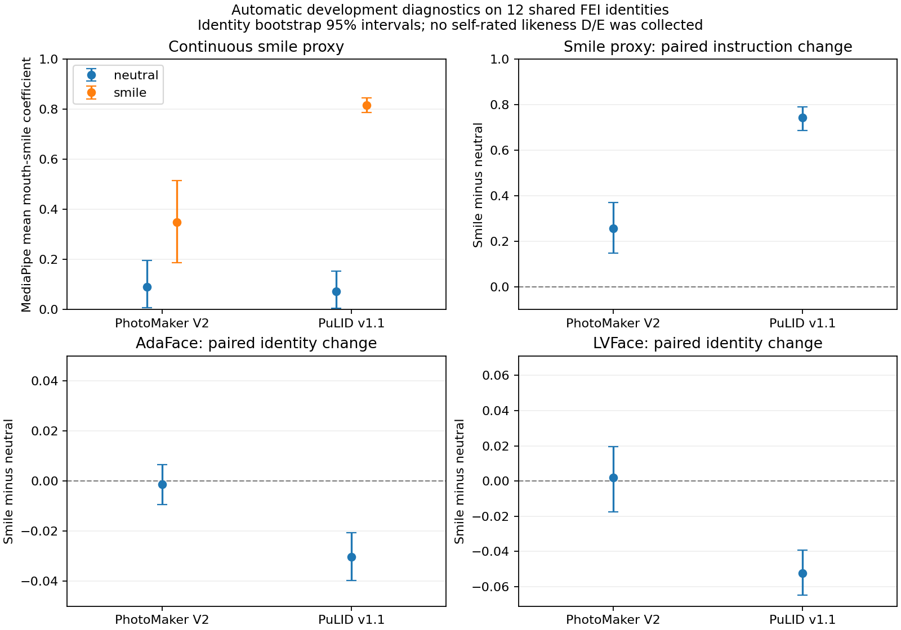
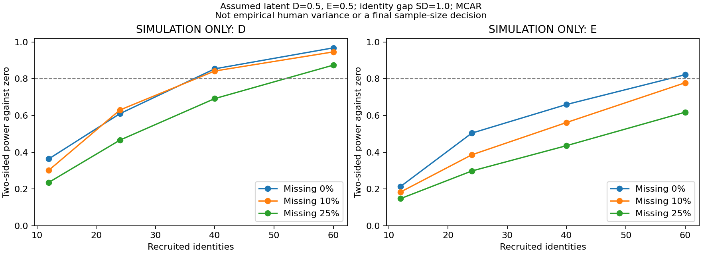

# 自动研究报告：自拍身份信息在生成过程中保留了什么？

日期：2026-09-05。研究性质：**开发与探索性诊断，不是独立确认实验，也不是新增人评**。

> 阅读顺序：先看“现在能回答什么”，再看任务表和图。文中的 cosine、LPIPS 和微笑系数都不是“本人觉得像自己”的评分。

## 1. 现在能回答什么

目前证据支持一个更具体的研究方向：**在这批 FEI 开发数据上，模型已经能够把图片引导到某个人的身份附近，但这与保留本人在意的外貌细节、表情习惯及整体感觉，是不同的目标。** 本轮把原来混在一起的几个问题拆开检查，没有把问题预先归咎于某一层网络。

已完成的诊断带来四点结果：

1. **识别器的核心结论具有一定稳健性。** 新增 AdaFace 后，正常身份条件仍能在八人图库中全部排第一；当两条身份通道来自不同人时，两种识别器仍主要跟随全局身份通道。这说明旧结果并非只有 LVFace 才观察得到。
2. **更多参考照片带来的自动收益有限，而且依赖指标。** AdaFace 的目标 cosine 提升较明确，但“目标相对最近非目标的优势”没有稳定提升。旧人评也没有支持多参考的 likeness 收益，因此不能把新 cosine 结果写成“多图让人觉得更像”。
3. **自动结果不支持把识别表征差距主要归因于基础 VAE 往返。** 真实照片经过一次确定性重建后，两种识别器仍保留较高相似度。这削弱了“主要问题只是基础压缩与解压”的解释；它并没有测量编解码的人类 likeness 影响，也没有定位整条扩散生成路径的主要损失，更不能计算各模块贡献百分比。
4. **第二系统提供了值得继续检验的自动差异。** 同一批 12 个开发身份上，PuLID 的身份 cosine 和 margin 都高于 PhotoMaker，微笑指令的实际响应也更大。PuLID 在微笑时出现识别相似度下降，但整体仍较高。它说明“身份保留”和“表情变化”需要一起测量；目前不能据此判定哪套系统在人眼中更像本人。

本轮仍然不能回答：本人到底觉得哪里不像、陌生人与本人是否使用不同细节、哪种干预真正提高本人评分。这些问题需要下一轮独立照片和盲评。

## 2. 执行范围与账目

统一配置：[auto_research.yaml](../configs/auto_research.yaml)。统一入口：[run_auto_research.py](../scripts/run_auto_research.py)。所有机器产物位于：

`artifacts/runs/20260905_auto_research/`

原实验 `20260903T050000Z_photomaker_v2_generation_pilot` 保持只读。新分析没有调用会改写原状态的旧 evaluator，也没有使用旧人评响应选择模型、阈值或参数。

| 任务 | 实际状态与数量 | GPU 任务时间，含失败尝试 | 已记录峰值分配 | 主要运行位置，均相对本轮根目录 |
|---|---|---:|---:|---|
| 文献与资产核查 | 完成；一手来源及固定资产锁 | CPU | 不适用 | 本文第 8 节、`provenance/` |
| 输入/历史噪声核验 | 192 输出、56 真实输入、96 配对；16 组 CUDA latent 全部一致 | 0.17 秒 | 小于 1 MiB | `audit/attempt_01/`、`provenance/` |
| A：冻结图诊断 | 完成，192/192 | 101.18 秒 | 0.68 GiB | `diagnostics/attempt_02/` |
| B：VAE | 完成，56/56 | 55.20 秒 | 1.45 GiB | `vae/attempt_01/` |
| C：PhotoMaker | 完成，48/48 | 595.68 秒 | 6.42 GiB | `photomaker/attempt_02/` |
| C：PuLID smoke | 完成，16/16；兼容性门槛在 28 分 20 秒内通过 | 572.78 秒 | 11.78 GiB | `pulid_smoke/attempt_03/` |
| C：PuLID 完整矩阵 | 完成，48/48，24 seed 配对 | 746.98 秒 | 9.97 GiB | `pulid_full/attempt_02/` |
| D：格式、分析、模拟 | 完成；576 情景、1,152 行终点结果 | CPU；功效运行约 11 秒 | 不适用 | `simulation/` |
| 工程验证 | 219 项测试、Ruff 与差异检查通过；依赖声明有下述例外 | CPU | 不适用 | `validation_final/` |

**累计下载 3,406,446,392 字节，约 3.41 GB；累计 GPU 任务时间 2,071.99 秒，约 34.53 分钟。** 两项账目均包含未成功尝试，所有计划中的自动实验已执行，没有因预算省略模型或单元。

预算上限为新增下载 30,000,000,000 字节、累计 GPU 任务时间 14,400 秒。GPU 时间按串行 GPU 工作进程的墙钟时间保守计量，包含部分加载、对齐和文件写入时间；显存表中的峰值是 PyTorch 分配量，不等于整个驱动或所有进程的总显存。

显存取工作进程、加载和逐图记录中的最大值，避免逐图重置计数后漏报。PuLID 两次卡顿中断没有返回最终分配器峰值，故表中数值是**已记录峰值**，不是整轮实际显存的严格上界。续跑图片保存在原未完成的 `attempt_01/generation/`，最终评估与实际执行快照分别位于表列的后续 attempt；完整映射保存在最终证据归档中。

环境方面，原 Python 在受限进程中无法访问，但在获准的执行环境中可正常启动。建立了 `.venv-auto`，复制本地已锁定依赖后增加推理组件；PuLID 另用 `.venv-pulid` 解决 NumPy/Numba 兼容问题。没有升级原 `.venv`。两个实际环境的完整包锁和运行元数据均留档。

依赖检查存在已记录的限制：MediaPipe 的包声明要求 `opencv-contrib-python`，当前推理实际使用已安装的 `opencv-python 5.0.0.93`；PuLID 环境的 NumPy 2.2.6 也与复制过来的项目安装元数据要求 2.4.6 不一致。实际推理、对齐和指标已通过运行验证，但 **`pip check` 尚非全通过**。复现应使用留档的实际环境锁，不能假定两套环境可合并安装。

新增模型、代码、安装包的版本、来源和 SHA256 见 [额外资产锁](../configs/auto_research.assets.lock.yaml)。后续 bootstrap 按这份锁取文件并验 hash，不再动态选择最新版本。

## 3. 192 张冻结生成图：新增了哪些证据

### 3.1 先确认账目，再计算分数

192 张图、六个条件、两个 prompt、两个 seeds 均与 manifest 对应，96 个 seed 配对完整；56 张原始真实照片包含输入参考和独立图库。每项输入都有样本 ID、来源 SHA256 和预处理记录。

本轮**重新计算** LVFace 和 AdaFace 特征，没有直接使用只含数组、缺少 ID 的旧 NPZ。新缓存可按 ID 重新排序，拒绝重复 ID、错误 hash 和错配。全部 192 张生成图可解码并保留一个检测到的人脸。对全部 248 张真实及生成图检查，未发现文件或解码像素的精确重复。

AdaFace 使用官方 IR50/WebFace4M，输入为固定五点对齐的 112×112 BGR 图像，归一化至 −1 到 1；检测及几何规则与 LVFace 共用。它没有参与本次 PhotoMaker 的身份条件注入。

### 3.2 “排第一”与“非常像”不是同一个指标

| 条件 | LVFace 目标 cosine | AdaFace 目标 cosine | 两种识别器的八人 Rank-1 |
|---|---:|---:|---:|
| 单张参考 K=1 | 0.56126 | 0.59591 | 都为 100% |
| 四张不同参考 | 0.57436 | 0.61598 | 都为 100% |
| 同一张重复四次 | 0.56043 | 0.59861 | 都为 100% |

cosine 可以理解为一个识别模型内部的方向接近程度。**两个模型的数值不能横向比较大小**；应在同一个识别器内部比较实验条件。

单图生成结果与“真实单图输入对真实图库”的参照相比，目标 cosine 仍有明显差距：LVFace 的真实减生成差为 0.35187，AdaFace 为 0.33417。这里的比较对象和人类任务不同，所以它只能叫**识别表征差距**，不能命名为本人评分中的 D。



图中各面板展示生成条件，使用各自识别器的数值尺度；误差线按身份抽样。G/P 表示全局通道与图像局部通道；真实照片参照的差距单独在上文报告。

### 3.3 多参考：有小幅自动变化，没有新的感知结论

| 目标 cosine 对比 | 变化 | 身份 bootstrap 95% 区间 |
|---|---:|---:|
| AdaFace：不同四图 − 单图 | +0.02008 | [+0.00518, +0.03312] |
| AdaFace：不同四图 − 重复四图 | +0.01737 | [+0.00532, +0.02789] |
| LVFace：不同四图 − 单图 | +0.01310 | 区间跨过 0 |

对应的 AdaFace 两个 margin 差异区间仍跨过 0。margin 指“目标相似度减去最近非目标相似度”，因此它回答的是目标身份有没有比其他人更突出。多个指标一起看，比只挑一个正结果更可靠。

这些区间来自八个已暴露身份的探索性分析，未作多重比较校正。旧 v2 人评中，多图对单图、不同四图对重复四图的偏好区间都包含 0.5；本轮没有改变这个结论。

### 3.4 冲突实验：再次确认的是模型响应，不是人类关注点

64 张互换身份来源的冲突输出中，LVFace 有 60 张跟随全局来源，AdaFace 为 61 张；两者对跟随方向的判断有 61/64 一致。

这支持“全局身份路径对自动识别结果有较大影响”。它不证明正常照片中局部细节不重要，也不证明人类评价应当跟随同一通道。旧人评的冲突任务有大量无法判断和明显身份异质性，仍属于未解决问题。

### 3.5 参考距离与 seed 差异

LPIPS 较小表示一般视觉特征更接近。全图版本将长边缩放至 256 后居中补灰边；人脸版本使用固定五点几何得到 256×256 裁切。它不是身份专用指标，背景、姿态和表情都可能改变它。

所有条件都与**同一张中性单图参考**比较；另外报告与各条件全部实际输入的平均及最小距离。这样不会把“四张候选里挑最接近的一张”的天然优势误当成方法提升。重复参考按实际槽位留档，但同一文件只计算一次。

共同单图参考的人脸 LPIPS：单图条件 0.40609、不同四图 0.42789、重复四图 0.41283。因此，不同四图的 cosine 提升并不伴随“更加接近那张共同输入照片”。这只是两种度量的区别，不能据此声称复制或去复制成功。



96 个 seed 配对均报告全图/人脸 LPIPS 和两种识别特征距离。前者关注画面变化，后者关注身份表征漂移。两颗 seeds 只能揭示这一固定配对的变化，不能代表生成分布的多样性。

MediaPipe 另外输出连续微笑系数、张嘴系数与约定坐标系下的姿态。旧 p0/p1 同时改变表情、视角、灯光和背景，不能从它们的差异单独推断微笑的因果效果。本轮没有在旧图上选择表情成功阈值。亮暗极值比例和固定尺度模糊统计只用于技术检查，不等价于美感、真实性或人类画质。

## 4. VAE 重建：56 张真实照片的基础检查

使用本地锁定的 RealVisXL VAE，float32、posterior mode，保持 640×480 原尺寸。直接执行 VAE 的 encode/decode，不把供扩散模型使用的缩放常数错误插入这次往返。tiling 开关已开启，但阈值为 1024，这批 640×480 输入没有实际触发分块。

| 指标 | 56 张照片的平均结果 |
|---|---:|
| 原尺寸浮点 PSNR | 38.98 dB |
| 原尺寸浮点 SSIM | 0.94253 |
| 原尺寸 LPIPS | 0.02159 |
| 固定人脸裁切 LPIPS | 0.01341 |
| 原图与重建，固定原始对齐的 LVFace cosine | 0.98232 |
| 原图与重建，固定原始对齐的 AdaFace cosine | 0.98701 |

PSNR 关注像素误差，SSIM 关注局部结构相似程度；这次实验中二者都不能单独代表人眼身份相似度。56/56 编解码完成，重复首个固定样本时潜变量和解码结果的最大差异均为 0。

重新检测后，LVFace/AdaFace cosine 分别约为 0.98147/0.98660；同一重建图在两种对齐方式下的 cosine 分别为 0.99780/0.99874。由此可以看出，检测位置变化确实会影响数值，但在这批图中差异较小。



**解释边界：**这些是“某张原图与它的重建”的比较；上一节则是“生成图与另外几张真实图库照片”的比较。两种比较不能相减来计算生成管线各阶段的损失。VAE 结果说明这里往返重建的自动变化较小，但未测量其人类 likeness 影响。

真实照片的重建较好，也不保证扩散模型产生的所有潜变量都能同样准确地解码。因此本实验没有排除生成潜变量与解码器之间的失配。

## 5. 单因素生成：把“微笑”从复杂 prompt 中单独拿出来

从 FEI `dev` 按身份 ID 与固定字符串 `autoresearch20260905` 的 SHA256 排序，预先选定 12 个身份，排除旧 pilot 八人；没有依据生成效果更换身份。固定一张中性输入和三张独立图库，两个 prompt 仅改变中性/微笑，每个 prompt 使用两颗固定 seeds。

新 PhotoMaker 的 **48/48 单元完成**，全部为单人脸，MediaPipe 也有 48/48 有效结果。它们仍是 FEI 开发数据，不能冒充自然自拍 cohort。

| PhotoMaker 检查 | 结果 |
|---|---:|
| 中性指令的平均微笑系数 | 0.09091 |
| 微笑指令的平均微笑系数 | 0.34867 |
| 配对微笑系数变化 | +0.25776；95% 区间 [+0.14853, +0.37046] |
| AdaFace 目标 cosine：微笑 − 中性 | −0.00135；区间 [−0.00941, +0.00658] |
| LVFace 目标 cosine：微笑 − 中性 | +0.00189；区间 [−0.01750, +0.01966] |
| 两种识别器的十二人 Rank-1 | 均为 100% |



12 个身份的微笑系数平均变化方向均为正，但部分变化很小，所以不把它叫“100% 表情成功率”。两种识别器的 margin 变化区间也都跨过 0。

姿态的三个原生 Euler 角平均变化约为 −0.48°、−0.17°、+0.22°，各自区间均跨过 0。角度分析使用环形差值，避免把 +179° 到 −179° 算成 358°；它没有经过相机标定，因此只是姿态代理量，也不能据此证明两种条件的真实姿态完全等同。

这个结果说明，在当前中性输入、正面影棚设置下，文字指令确实改变了自动测得的微笑程度，但没有表现出稳定的大幅识别身份损伤。它削弱了“只要让人微笑，识别身份就必然大幅下降”的笼统解释。人眼是否仍觉得不像、微笑是否符合本人习惯，依然没有测量。

第二模型 PuLID v1.1 已完成 16 单元 smoke，再独立重新生成完整 48 单元。全部通过单人脸检查和表情/姿态诊断；smoke 与完整矩阵重合的 **16 张图片在文件和解码像素上均完全一致**。这验证了本轮显存驻留调整没有改变这些固定单元的输出；这 16 张重复图不是新增独立样本。

| 同一批 12 身份的检查 | PhotoMaker V2 | PuLID v1.1 |
|---|---:|---:|
| AdaFace 总体目标 cosine | 0.60997 | 0.74177 |
| LVFace 总体目标 cosine | 0.54844 | 0.69690 |
| 两种识别器十二人 Rank-1 | 均 100% | 均 100% |
| 中性 / 微笑的连续微笑系数 | 0.09091 / 0.34867 | 0.07158 / 0.81553 |
| 微笑系数：微笑 − 中性 | +0.25776 | +0.74395 |
| AdaFace：微笑 − 中性 | −0.00135，区间跨 0 | −0.03031，区间 [−0.03974, −0.02054] |
| LVFace：微笑 − 中性 | +0.00189，区间跨 0 | −0.05218，区间 [−0.06460, −0.03907] |

按身份配对后，PuLID − PhotoMaker 的总体目标 cosine 差为 AdaFace +0.13180（95% 区间 [+0.10061, +0.16514]）、LVFace +0.14846（[+0.12388, +0.17735]）；margin 差分别为 +0.12034 和 +0.14457，区间也均在 0 以上。PuLID 到共同单图参考的人脸 LPIPS 更低，中性/微笑条件的差分别为 −0.10327/−0.07191；全图 LPIPS 差异区间均跨过 0。



这些结果支持的是**当前完整系统的自动差异**。两系统沿用同一 RealVisXL 基础权重、1024 分辨率和输入；48 对初始 latent hash 全部相同。但 PhotoMaker 使用 30 步、CFG 5、Euler、merge step 10；PuLID 使用 25 步、CFG 7、DPM++ 2M、ID scale 0.8、`num_zero=20` 和 `ortho_v2=true`，并移除 PhotoMaker 专属 `img` 触发词。相同噪声也不等于相同去噪轨迹。

进一步对每个身份计算“PuLID 的微笑−中性变化，再减去 PhotoMaker 的同一变化”：AdaFace cosine 的差分为 −0.02896（95% 区间 [−0.04278, −0.01421]），LVFace 为 −0.05407（[−0.07402, −0.03023]）；与此同时，微笑系数变化的差分为 +0.48619（[+0.36386, +0.60960]）。这直接检验了两系统对**固定指令**的响应差异，而实际笑的幅度并未匹配。

PuLID 的实际微笑幅度更大，姿态代理量也有小幅变化，因此不能把身份分数变化直接归因于某个身份模块，更不能把两套系统当成“相同程度的微笑”来比较。更低的人脸 LPIPS 只是更接近输入，不是已测得的复制率。

工程上，PuLID 最初在 float32 VAE 解码阶段遇到显存驻留卡顿。修复方法是缓存身份条件后释放不再使用的参考编码器，并在完整矩阵的 VAE 解码时暂时将 UNet/文本编码器移到 CPU，随后恢复。精度、模型权重、分辨率、tiling、身份及 seeds 保持固定；所有中断耗时和尝试均留档，没有根据生成质量重抽样。

新矩阵统一使用 CPU 随机数生成初始 latent，便于匹配 PuLID 官方内部的噪声实现；这与旧 pilot 的 CUDA 随机数来源不同，不能把相同 seed 数字误当成与旧图使用相同噪声。新矩阵内部的 ID、seed 和 latent 均固定，旧 16 组 CUDA latent 也已重新生成核验，覆盖全部 192 旧单元。

## 6. 后续人评所需工具已经准备到什么程度

实现了独立的新研究数据格式与校验器：[likeness_study.py](../src/id_layers/likeness_study.py)。每个身份的照片角色是输入 1 张、图库 3 张、中性真实候选 2 张、微笑真实候选 2 张；真实与生成候选使用统一格式。校验器检查身份划分、照片/hash 重复、角色泄漏、候选与评分任务对应关系。

输入方式及模拟示例说明见 [AUTO_RESEARCH_INPUTS_ZH.md](AUTO_RESEARCH_INPUTS_ZH.md)。

本人评分与陌生人评分分开解析。本人就是对应身份，不人为把“身份”和“本人评分者”当成两个独立随机来源；陌生人可跨身份评分，分析保留身份与评分者的交叉依赖。

设 R₀/G₀ 为中性真实/生成候选的平均评分，R₁/G₁ 为微笑对应评分：

```text
D = [(R₀ − G₀) + (R₁ − G₁)] / 2
E =  (R₁ − G₁) − (R₀ − G₀)
```

在本人终点中，D 为正表示真实照片的本人 likeness 评分更高；E 为正表示微笑条件的差距更大。陌生人的 D/E 则针对图库参照下的相似度，单独报告。先在每个身份内平均，再对身份等权汇总，避免照片多或评分多的人占更大权重。

缺失与“无法判断”不会计成零。工具报告计划/有效数量、各格覆盖、八张候选均至少有一个有效评分的敏感性分析，以及在 1–7 分范围内填补缺失时的上下界；该敏感性分析不要求陌生人任务的每位计划评分者都作答。没有成功生成图片属于操作失败，不能伪造一个 likeness 评分。

模拟示例明确标记 `SIMULATION_ONLY`，包含本人和陌生人的响应及分析；这些虚构记录没有进入旧人评目录，也没有被当成真实结果。

## 7. 功效模拟教会了我们什么

配置网格包含身份数 12/24/40/60、多个效应与身份变异、0/10%/25% 缺失，并包含随机缺失和低评分更容易缺失的敏感性情景。每个情景重复 500 次，共 576 个情景、1,152 行 D/E 结果；额外生成独立大样本参照，核对离散化后的实际效应与区间覆盖。

举一个**假设情景**：设定平均差距 0.5、表情额外差距 0.5、身份差距标准差 1、随机缺失 10%。由于评分被四舍五入并限制在 1–7，实际总体 D/E 约为 0.532/0.467，不能把设定的潜在效应直接当成最终评分效应。

| 身份数 | 检出 D 的概率 | 检出 E 的概率 |
|---:|---:|---:|
| 12 | 30.2% | 18.4% |
| 24 | 63.0% | 38.6% |
| 40 | 84.2% | 56.2% |
| 60 | 94.6% | 77.8% |

这里“检出”指固定身份均值分析的双侧 95% 区间排除 0。本人主要区间采用身份级均值的 t 区间，与模拟保持一致；身份 bootstrap 另作敏感性。陌生人分析保留交叉 bootstrap，其功效不能直接借用这张本人模拟表。

这里的 10% 是**每张候选的本人评分缺失概率**，不是 10% 参与者整个人退出。只要四个格子各保留至少一个评分，该身份仍可分析；上述 40 人情景平均有 38.40 个可分析身份。本轮没有单独模拟整人退出，招募时还需另行考虑。



还需留意两点：低评分缺失情景中的缺失率是基础概率参数，实际实现率另列，不能当成与随机缺失完全匹配；评分的截断和取整可能改变均值，所以潜在效应为 0 不保证观测评分效应也为 0。覆盖率使用模拟得到的观测尺度总体效应核查。

在这个假设情景里，E 比 D 更难测；这也说明“40 人够不够”取决于实际变异、效应和缺失。**本轮没有测得真实本人评分方差，40 人仍不是已确定的正式样本量。** 后续应先拿到有授权的开发数据，再冻结确认实验所需人数与分析规则。

## 8. 文献如何改变了课题的方向

完整的一手证据对照表见 [AUTO_RESEARCH_LITERATURE_ZH.md](AUTO_RESEARCH_LITERATURE_ZH.md)。最重要的启示是：

- [Face2Diffusion](https://openaccess.thecvf.com/content/CVPR2024/html/Shiohara_Face2Diffusion_for_Fast_and_Editable_Face_Personalization_CVPR_2024_paper.html) 将多尺度身份、表情控制与去噪约束分别处理，支持拆开检查信息通道；它不支持普遍的“最后一层把身份抹掉”。
- [F-Bench](https://openaccess.thecvf.com/content/ICCV2025/html/Liu_F-Bench_Rethinking_Human_Preference_Evaluation_Metrics_for_Benchmarking_Face_Generation_ICCV_2025_paper.html) 把身份、画质、真实性与文字对应分开评估，提醒我们不能用一个识别分数替代全部体验。
- [WithAnyone](https://arxiv.org/abs/2510.14975) 研究身份保持与参考复制倾向的取舍，提醒“与输入更近”不一定总是优点。本轮的数据条件不足以照搬其复制评测，因此只报告连续参考距离。

因此，下一轮的核心贡献仍应是一个完整诊断：**先证实独立真实参照下的人类 likeness 差距，再判断哪一种信息缺失值得干预。** 不需要为了让课题看起来像方法论文，提前训练 mapper，或从未通过预设门槛、未支持稳定中间层优势的 E2 结果中再挑一个中间层。

## 9. 可复现性、已知限制与下一步

原实验目录的 **1,337 个文件前后 hash 全部一致**。旧图与新图的 ID、输入角色、输出 hash、配对和初始噪声均有独立核验。219 项 CPU 测试覆盖乱序输入、重复 ID、错误 hash/配对、常量/损坏图、无人脸/多脸、VAE 缩放和对齐，以及 D/E 方向、身份等权、缺失与评分者依赖；Ruff 和 `git diff --check` 通过。`pip check` 的两类环境限制见第 2 节，原始日志保存在 `validation_final/`。

固定 batch=32 时，两种识别器的重复提取最大误差均为 0。改变 batch 大小会产生小数值差异，例如旧图 LVFace/AdaFace 的 batch=2 与 32 最大差约为 0.000219/0.000066，因此复现时应同时固定 batch。VAE 首张往返和 PuLID 的 16 张重复生成也已分别核验。

最终证据归档由 [finalize_auto_research.py](../scripts/finalize_auto_research.py) 创建，位于本轮 `provenance/final_*/`：包含新运行文件清单、旧运行完整性、下载/GPU 对账、每个完成矩阵对应的实际工作进程源码快照和环境锁。早期失败与中断仍在清单中。续跑与超时控制另经真实 Windows CPU 子进程测试，超时后须验证整个所属进程树已退出，才能释放 GPU 预留。

复现入口，PowerShell 中使用独立环境：

```powershell
.\.venv-auto\Scripts\python.exe scripts/run_auto_research.py check
.\.venv-auto\Scripts\python.exe scripts/run_auto_research.py resume
.\.venv-auto\Scripts\python.exe scripts/run_auto_research.py summarize
```

完成任务会被跳过；失败尝试保留，工程修复后才显式使用 `--retry-failed`。生成续跑保留已完成和失败单元，不更换身份、不挑选最佳 seed。补充下载分别保留字节账本，并在总汇中合并核查。

查找逐项结果时，可以按以下顺序阅读运行目录：

| 想查看什么 | 文件或目录 |
|---|---|
| 每张图是否有效、身份分数、技术检查、表情/姿态 | 各 evaluation 下的 `coverage.csv`、`identity_metrics.csv`、`image_qc.csv`、`landmarks.csv`；旧图补充诊断直接位于 `diagnostics/attempt_02/` |
| 与参考照片的全部距离、固定 seed 配对 | `reference_pair_distances.csv`、`reference_distances.csv`、`seed_pair_manifest.json`、`seed_lpips_distances.csv`、`seed_identity_distances.csv` |
| 身份等权结果和不确定性 | `diagnostics_analysis/`、`photomaker_analysis/`、`pulid_full_analysis/`，以及单独的 `*_pose_analysis/` |
| 两系统配对比较、指令交互与重复生成核验 | `model_comparison/`、`expression_system_interaction/`、`pulid_reproducibility/` |
| 原图/重建的逐图记录、固定和重新对齐结果 | `vae/attempt_01/`、`vae_analysis/` |
| 实际配置、失败尝试、资源消耗、旧运行是否改变 | `tasks.json`、各 `attempt_*`、`resource_ledger.json`、`pulid_download_ledger.json`、`source_integrity.json` |
| 模拟评分与功效场景 | `simulation/`；全部标记为模拟，不是参与者数据 |

接下来必须由人参与的工作是：取得新 cohort 的适用许可/审批，按互不重叠的照片角色采集数据，完成本人和陌生人的盲评，再用开发数据校准正式样本量。当前自动结果可以指导这个实验设计，不能跨过它直接宣称“已经解决不像自己”。
